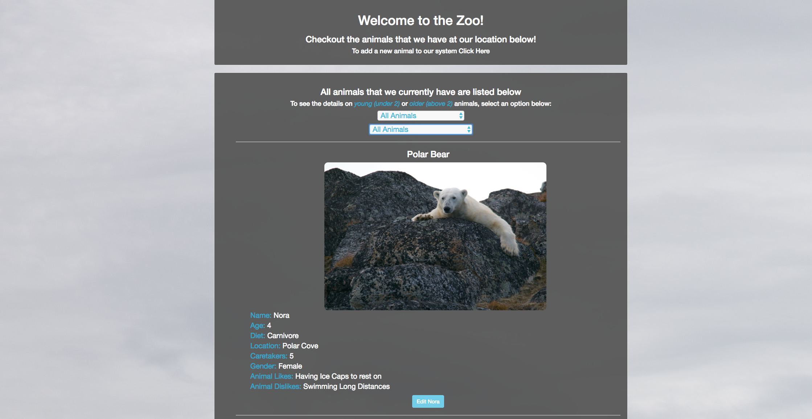
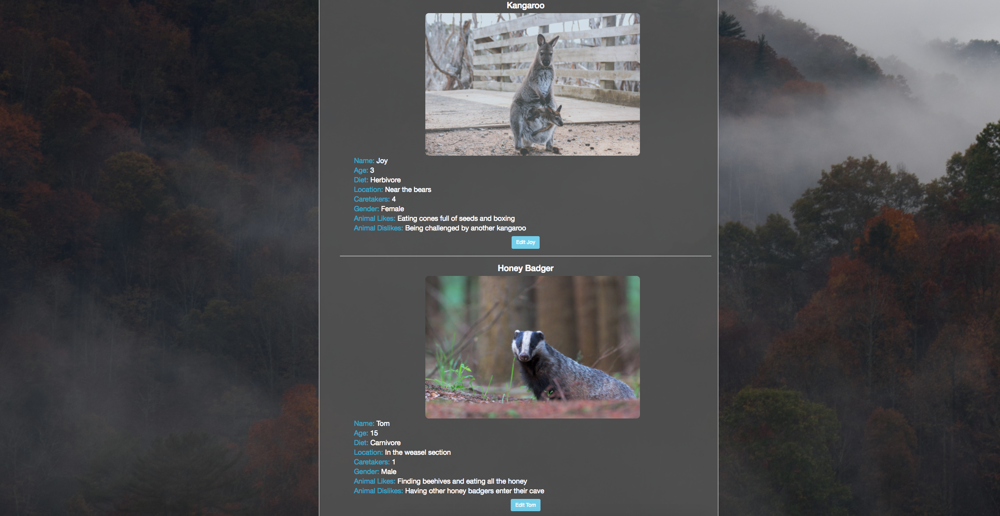
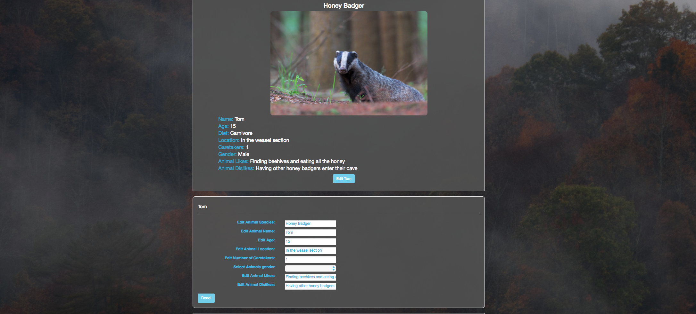
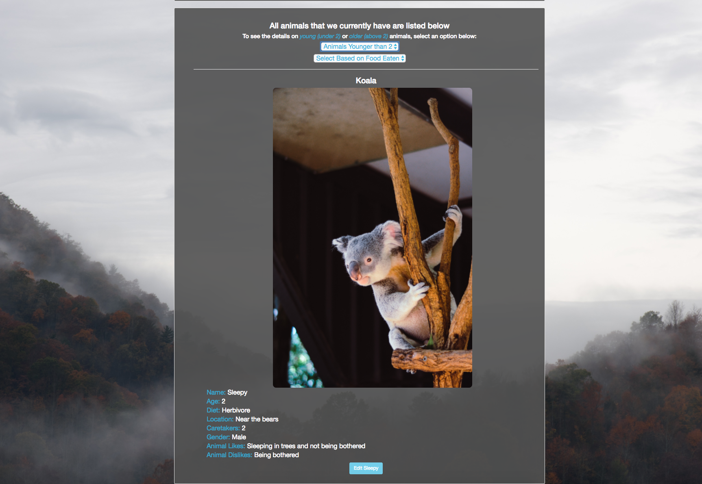
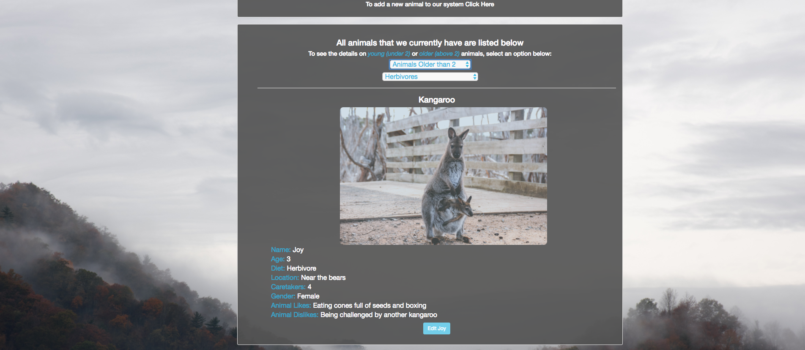

# The Zoo

#### Epicodus JavaScript Week 3 Project, September 22, 2017

#### By Stephanie Mayer

## Description

_This application uses Angular and Typescript to create a zoo intake form to keep track of the animals. The form allows a person to add an image of the animal as well as other important details about the animal. After an animal is added, it can also be edited, allowing the user to correct mistakes when they are made._

## An image of the front page of the application

## A look at all the animals that are at the zoo

## The ability to edit Tom, the honey Badger. Or any animal

## Add a new animal to the zoo

## Sort by the animals diet

## Sort by the animals age

## An image of the sort function in action

## Sort by their diet and age, to find the animals that match that query



## Setup/Installation Requirements
* Clone the repo from git hub using:
````
$ git clone https://github.com/smayer0926/Zoo
````
* Open the project in your favorite editor, this was created in Atom.
* Experiment!

_To use tis project you will need the following installed properly on your computer._
* You will need to install gulp and bower:
````
$ npm install
$ bower install
````
* Make sure to rebuild the file after making any changes to the js files, using:
````
$ gulp build
````
 or by using:
````
$ gulp serve
````
* Open in your favorite browser, if you just use gulp build, otherwise it will be launched by gulp serve.

## Specifications

| Behavior      | Example Input      | Example Output       |
| ------------- | ------------- | ------------- |
| Add an animal to the zoo using a form | Polar Bear, Polar, 4, Carnivore, Polar Cove, 5, Female, Having Ice caps to sleep on, Swimming long distances | Species: Polar Bear, Name: Polar, Age: 4, Location: Polar Cove, Caretakers: 5, Gender: Female, Animal Likes: Having Ice caps to sleep on, Animal Dislikes: Swimming long distances |
| Sort by age | See animals under 2 | No results found |
| Sort by diet | Carnivores | Polar Bear, Polar |
| View all Animals | View all Animals | All animals shown |
| Edit an animal | Polar Bear, Frosty, 6, Carnivore, Polar Cove, 5, Female, Having Ice caps to sleep on, Swimming long distances | Species: Polar Bear, Name: Frost, Age: 6, Location: Polar Cove, Caretakers: 5, Gender: Female, Animal Likes: Having Ice caps to sleep on, Animal Dislikes: Swimming long distances |

## Future Exploration
* _To add more functionality to this application it would be nice to an API that could be used to populate the database with animals and the other information. As well as having the functionality to add animals by hand. _
* _Another functionality that would be great would be to have a calculation that could tell the zoo how many caretakers they need on hand at a time._

## Questions or Concerns
_If there are any questions or concerns, please contact me at smayer0926@gmail.com_

## Known Bugs
_No known bugs at this time._

## Technologies Used

* _Atom_
* _Gulp_
* _Bower_
* _Angular_
* _TypeScript_


### License

Copyright &copy; 2017 Stephanie Mayer
